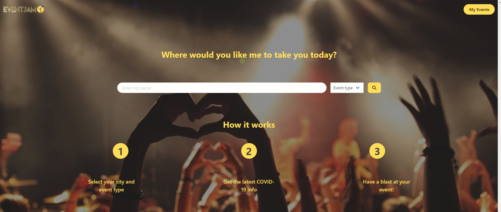
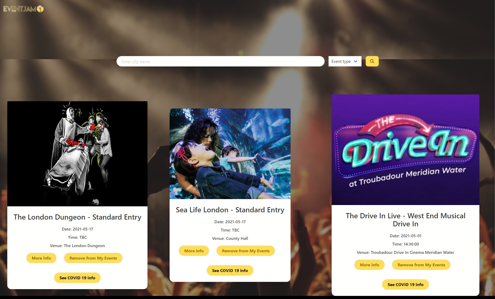
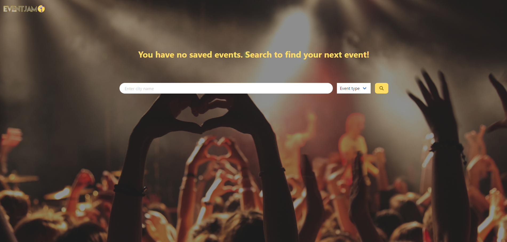

# Event Jam

## Table of Contents

- [Event Jam](#event-jam)
  - [Table of Contents](#table-of-contents)
  - [Github Pages URL](#github-pages-url)
  - [Description](#description)
  - [What Was Done](#what-was-done)
  - [Getting started](#getting-started)
  - [Screenshots](#screenshots)
    - [Homepage](#homepage)
    - [Results Page](#results-page)
    - [Results Page with Displayed Covid-19 Info](#results-page-with-displayed-covid-19-info)
    - [My Events Page](#my-events-page)
    - [My Events Page No Events Saved](#my-events-page-no-events-saved)
    - [No Events Matching Criteria Found](#no-events-matching-criteria-found)

## Github Pages URL

Click [here](https://iwanagahime.github.io/event-jam/) to view project on GitHub pages.

## Description

We were asked to build an interactive application based on our own innovative idea that uses at least two server-side APIs.

User Story
As a user I want to search for events in a given location and at the same time stay up to date with the current COVID-19 info for that location so that I can book my tickets accordingly. As a user I want to be able to search for events from any page in my application and not being limited to using only Homepage to do my searches.

```
GIVEN an EventJam Homepage with search inputs
WHEN I search for a city and optionally for event type
THEN I am redirected to Results page and presented with events taking place in that city.Events are displayed as cards with event image, name, the date, time and venue shown. Each of the cards contains navigation buttons - one linking the app to event page on TicketMaster and the other allowing the user to save the event in My Events page if it hasn't been saved already. If the event has been already saved a Saved button is rendered instead of Save Event one.
THEN I am taken to the Results page and presented with the current Covid-19 information for that location
WHEN I scroll down
THEN I have the option to click the Load More button and another twenty event cards are displayed
When I click on the My Events button on the Homepage or the Results page
THEN I am redirected to the My Events page where cards with my saved events are displayed
WHEN I am presented with the cards for my favorite events
THEN I have the option of navigating to the TicketMaster page for a given event, rendering current Covid-19 info for that event location or removing the event from favorites
WHEN I have no saved events
THEN I am presented with a message prompting me to make a search as there are no events saved

```

## What Was Done

- We created a landing page that includes a search bar allowing the user to search for events by city and event type
- Our search inputs are displayed on each of the application pages
- We dynamically created an event card containing such data as event image, event name, date, time and venue
- Our events cards contain navigation buttons
- We used a CSS framework (Bulma) to style our application
- We used Adobe xd to create page design
- We used the [TicketMaster](https://developer.ticketmaster.com/products-and-docs/apis/discovery-api/v2/) to retrieve events data
- We used the [UK Coronavirus Dashboard] (https://coronavirus.data.gov.uk/details/developers-guide) to retrieve Covid-19 data
- We formatted our code using prettier

## Getting started

- Clone the GitHub project onto your local machine
- Navigate into the project
- Open the project in VSCode
- Open the `script.js` file in your default browser

```
git clone https://iwanagahime.github.io/event-jam/.
code .
```

## Screenshots

### Homepage



### Results Page


### Results Page with Displayed Covid-19 Info


### My Events Page



### My Events Page No Events Saved



### No Events Matching Criteria Found


