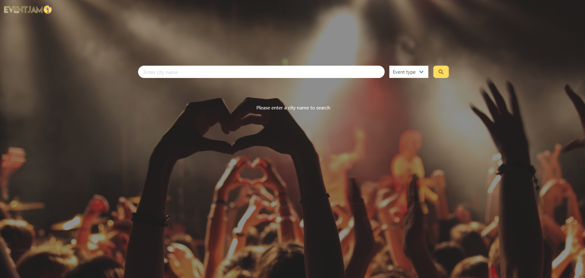

# Event Jam

## Table of Contents

- [Event Jam](#event-jam)
  - [Table of Contents](#table-of-contents)
  - [Deployed Github Page](#deployed-github-page)
  - [Contributors](#contributors)
  - [Getting Started](#getting-started)
  - [Project Overview](#project-overview)
    - [Motivation](#motivation)
    - [Description](#description)
    - [Tech Used](#tech-used)
      - [APIs](#apis)
        - [Ticketmaster](#ticketmaster)
        - [UK CoronaVirus Dashboard](#uk-coronavirus-dashboard)
      - [Frameworks](#frameworks)
        - [Bulma](#bulma)
        - [jQuery](#jquery)
        - [Chart JS](#chart-js)
    - [User Story](#user-story)
  - [What Was Done](#what-was-done)
    - [Planning](#planning)
    - [Development](#development)
      - [Key Features](#key-features)
        - [Covid Data](#covid-data)
        - [Search from Anywhere](#search-from-anywhere)
        - [Asynchronous Loading](#asynchronous-loading)
        - [Local Storage](#local-storage)
    - [Successes](#successes)
    - [Challenges](#challenges)
    - [Future Development](#future-development)
      - [Style](#style)
      - [Functionality](#functionality)
      - [Features](#features)
  - [Screenshots](#screenshots)
    - [Homepage](#homepage)
    - [Results Page](#results-page)
    - [Results Page with Displayed Covid-19 Info](#results-page-with-displayed-covid-19-info)
    - [My Events Page](#my-events-page)
    - [My Events Page No Events Saved](#my-events-page-no-events-saved)
    - [No Events Matching Criteria Found](#no-events-matching-criteria-found)

## Deployed Github Page

Click [here](https://iwanagahime.github.io/event-jam/) to view project on GitHub pages.

## Contributors

Dominika Pietrzak: [Github](https://github.com/dominikacookies),
[LinkedIn](https://www.linkedin.com/in/dominika-pietrzak-183755137/)

Soumeya Hassan: [here](https://github.com/SoumeyaH), [LinkedIn](https://www.linkedin.com/in/soumeya-hassan-0a12a5203/)

Eliza Krucon: [here](https://github.com/iwanagahime), [LinkedIn](https://www.linkedin.com/in/eliza-krucon-a84426204/)
Adam Arthur: [here](https://github.com/KingArthur0877), [LinkedIn](https://www.linkedin.com/in/adam-arthur-315b39156/)

## Getting Started

- Clone the GitHub project onto your local machine
- Navigate into the project
- Open the project in VSCode
- Open the `script.js` file in your default browser

```
git clone https://iwanagahime.github.io/event-jam/.
code .
```

## Project Overview

### Motivation

With the successful vaccine roll out and summer coming the past year of lock-downs and restrictions will start to seem a distant memory, as people look to start seeing friends and family again offline.

However, we know how quickly the situation can change and how constant alterations to restrictions rules and COVID-19 hotspots can make it difficult to plan a safe time. So at Event Jam were here to help.

### Description

Event Jam is a dynamic online application that offer users the ability to search for events in any city in the UK and get relevant, reliable and up to date covid-19 information for that area. By using our dynamic application that utilizes two different server-side APIs to get you all the information you could need to safely and easily plan a day out.

### Tech Used

#### APIs

##### [Ticketmaster](https://developer.ticketmaster.com/)

Ticketmaster provides real time and up to date listings for events throughout the UK. It provides all the information you could need from event details, images to pagination.

##### [UK CoronaVirus Dashboard](https://coronavirus.data.gov.uk/)

We used the UK Governments' Covid-19 API to ensure we got reliable and up to date data for our users. We choose to display case numbers, rather than other data such as death rates or vaccinations, as that seemed most relevant to our users.

#### Frameworks

##### [Bulma](https://bulma.io/)

We decided to use the Bulma CSS framework as it had many great and responsive components tat helped our designs come to life quickly. It provided us with plenty of room to implement our adjustments with out detriment.

##### [jQuery](https://jquery.com/)

With great documentation and community jQuery was a logical choice as it makes DOM manipulation straightforward. Whilst helping to keep code easy to read, maintain and scale.

##### [Chart JS](https://www.chartjs.org/)

We displayed our Covid-19 data in a chart showing cases for the last 30 days, so our users could see trends easily. Chart JS was a great choice to do this as it has clear documentation, and the charts are fully responsive out the box.

### User Story

As a user I want to search for events in any city in the UK, and at the same time receive up to date COVID-19 information for that location. So that I can make an informed decision when booking my tickets accordingly.

```
GIVEN an EventJam Homepage with search inputs
WHEN I search for a city and optionally for event type
THEN I am redirected to Results page and presented with events taking place in that city.Events are displayed as cards with event image, name, the date, time and venue shown. Each of the cards contains navigation buttons - one linking the app to event page on TicketMaster and the other allowing the user to save the event in My Events page if it hasn't been saved already. If the event has been already saved a Saved button is rendered instead of Save Event one.
THEN I am taken to the Results page and presented with the current Covid-19 information for that location
WHEN I scroll down
THEN I have the option to click the Load More button and another twenty event cards are displayed
When I click on the My Events button on the Homepage or the Results page
THEN I am redirected to the My Events page where cards with my saved events are displayed
WHEN I am presented with the cards for my favorite events
THEN I have the option of navigating to the TicketMaster page for a given event, rendering current Covid-19 info for that event location or removing the event from favorites
WHEN I have no saved events
THEN I am presented with a message prompting me to make a search as there are no events saved

```

## What Was Done

- We created a landing page that includes a search bar allowing the user to search for events by city and event type
- Our search inputs are displayed on each of the application pages
- We dynamically created an event card containing such data as event image, event name, date, time and venue
- Our events cards contain navigation buttons
- We used a CSS framework (Bulma) to style our application
- We used Adobe xd to create page design
- We used the [TicketMaster](https://developer.ticketmaster.com/products-and-docs/apis/discovery-api/v2/) to retrieve events data
- We used the [UK Coronavirus Dashboard] (https://coronavirus.data.gov.uk/details/developers-guide) to retrieve Covid-19 data
- We formatted our code using prettier

### Planning

Before we wrote a single line of code we created flowcharts, wireframes, to do Adobe xd for each of our pages and scenarios.

This allowed us to not only see the entire application in action but also identify where things may go wrong and where there are opportunities to reuse our functions.

### Development

to do idk say
something about team work, github issues thing, useful for delegating

#### Key Features

##### Covid Data

##### Search from Anywhere

##### Asynchronous Loading

##### Local Storage

### Successes

### Challenges

### Future Development

#### Style

We would ensure that results cards rendered are more uniform, giving a more pleasant user experience. We would also try to edit the card title lengths.

#### Functionality

The ability of users to get the relevant information as quickly as possible is of upmost importance to us. As such we would include more ways for users to filter their searches such as

- by event date
- distance from user location

#### Features

In the MyEvents page where users can store their favorite events so as come back later to book.

- We would alert users when user when date approaching saved event, so they don’t miss out.
- Remove events for which the date has passed

In regards to the coronavirus information we would like to add a section on current government policy for the area searched as we know how confusing the tiered system was.

## Screenshots

### Homepage


### Results Page


### Results Page with Displayed Covid-19 Info


### My Events Page


### My Events Page No Events Saved


### No Events Matching Criteria Found


